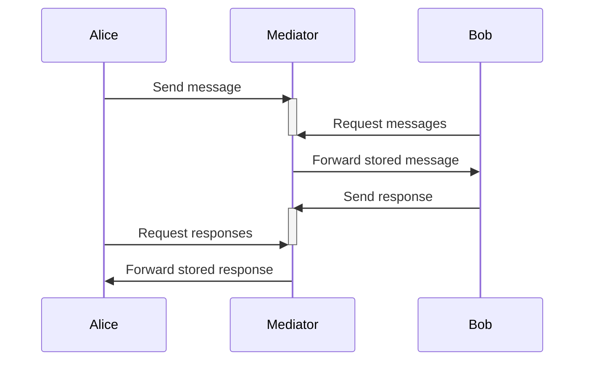

# DIDComm messaging

DIDComm Messaging is a secure, private communication methodology built on decentralized identifiers (DIDs). What makes it unique is its ability to structure messages into higher-level application protocols and workflows while maintaining trust.

The DIDComm Messaging design attempts to be:

- **Secure**: Messages are encrypted and signed, ensuring that only the intended recipient can read them and that the sender is who they claim to be.

- **Private**: It ensures that unauthorized third parties cannot know the details of the communication, and gives the sender the option to remain anonymous to the recipient.

- **Decentralized**: Trust for encryption, signing, authentication, and authorization is derived from control of decentralized identifiers rather than centralized authorities like CAs or IDPs, making it usable at the edge.

- **Transport-agnostic**: Messages can be passed over any transport including HTTPS 1.x and 2.0, WebSockets, BlueTooth, chat, push notifications, etc.

- **Routable**: Messages can be passed through intermediaries, allowing for complex routing topologies.

- **Interoperable**: Works across programming languages, blockchains, vendors, OS/platforms, networks, legal jurisdictions, geographies, cryptographic schemes, and hardware — as well as across time; avoids vendor lock-in.

- **Extensible**: Allows developers to start simple without heavy learning or dependencies, easily customize, and facilitate higher-level protocols that inherit DIDComm Messaging’s guarantees.

- **Efficient**: doesn’t waste bandwidth, battery, storage space, or CPU

You can visit [DIDComm messaging](https://identity.foundation/didcomm-messaging/spec/) for more information.

## DIDComm Mediator

DIDComm has different implementations, one of them is the DIDComm Mediator, this is useful when two parties are not directly connected to each other for different reasons, such as no internet connection, etc.

DIDComm Mediator facilitate the communication being the intermediary, it receives the message from the sender and forwards it to the recipient, and vice versa. The Mediator can be a simple server or a more complex system that can handle multiple messages at the same time, it depends on the requirements. The following diagram shows the sequence of messages between the sender, the mediator, and the recipient.



# Build DIDComm Mediator

## Tech requirements

Minimum versions required:

- [docker](https://www.docker.com/): v27.1.1
- [docker-compose](https://docs.docker.com/compose/): v2.29.1

## Run project

To run the project, you need to run the following command:

```bash
docker compose up --build
```

## Configure Mediator

1. Go to http://localhost:3336/api-docs

2. Create new DID using `POST /didManagerCreate` endpoint

```json
{
  "alias": "did_mediator",
  "provider": "did:ethr:celo",
  "kms": "local"
}
```

3. For add DIDComm service in the DID you have to transfer tokens to the wallet address of the DID, You can resolve the DID and get this address using the `POST /resolveDid` endpoint

```json
{
  "didUrl": "did:ethr:celo:0x..."
}
```

In the response look for the `blockchainAccountId` field, after `eip155:` this is the wallet address.

4. Add DIDComm service using `POST /didManagerAddService` endpoint. The `serviceEndpoint` should be a public URL where the mediator is running for this example you can use Ngrok to expose the local server to the internet.

   ```json
   {
     "did": "did:ethr:celo:0x...",
     "service": {
       "id": "didcomm_service",
       "type": "DIDCommMessaging",
       "serviceEndpoint": "https://f53a-2800-e422-5546-8c81.ngrok-free.app/messaging"
     },
     "options": {
       "ttl": 432000 // 5 days - You can change this value as needed or 31536000 for a year
     }
   }
   ```

5. Add did manager key, You have to use two endpoints, one for create a key and another for add the key to the DID.

   5.1. Create a key using `POST /keyManagerCreate` endpoint

   ```json
   {
     "type": "X25519",
     "kms": "local"
   }
   ```

   5.2. Add the key to the DID using `POST /didManagerAddKey` endpoint

   ```json
   {
     "did": "did:ethr:celo:0x...",
     "key": {}, // The response of the previous request
     "options": {
       "ttl": 432000 // 5 days - You can change this value as needed or 31536000 for a year
     }
   }
   ```

6. Now you Mediator is ready to use.

## Configure Sender and Recipient DIDs

You have to repeat all steps you for the sender and recipient DIDs. The only change is the `serviceEndpoint`, here you have to use the Mediator DID.

### Configure Agent

If you have remote Veramo agents you can use the following code to connect.

Use the next repository to configure the agent. [Connection to the remote Node](https://github.com/Identi-OpenSource/connect-identi-node)

```js
const response = await fetch(`${AGENT_OPEN_API}/open-api.json`);
const schema = await response.json();
const agent = createAgent({
  plugins: [
    new AgentRestClient({
      url: `${AGENT_OPEN_API}/agent`,
      headers: {
        Authorization: `Bearer ${AGENT_API_KEY}`,
      },
      enabledMethods: Object.keys(schema['x-methods']),
      schema,
    }),
  ],
});

const mediatorDID = 'did:ethr:celo:0x...';
```

### Configure Mediation

1. Create mediator connection

```js
const createMediatorConnection = async (recipientDID) => {
  try {
    // Create mediate request
    const mediateRequestMessage = createV3MediateRequestMessage(
      recipientDID,
      mediatorDID
    );

    const packedMessage = await agent.packDIDCommMessage({
      packing: 'authcrypt',
      message: mediateRequestMessage,
    });

    const sentMessage = await agent.sendDIDCommMessage({
      messageId: mediateRequestMessage.id,
      packedMessage,
      recipientDidUrl: mediatorDID,
    });

    // Update mediate request
    const update = createV3RecipientUpdateMessage(recipientDID, mediatorDID, [
      {
        recipient_did: recipientDID,
        action: UpdateAction.ADD,
      },
    ]);

    const packedUpdate = await agent.packDIDCommMessage({
      packing: 'authcrypt',
      message: update,
    });
    const updateResponse = await agent.sendDIDCommMessage({
      packedMessage: packedUpdate,
      recipientDidUrl: mediatorDID,
      messageId: update.id,
    });

    const query = createV3RecipientQueryMessage(recipientDID, mediatorDID);

    const packedQuery = await agent.packDIDCommMessage({
      packing: 'authcrypt',
      message: query,
    });
    const queryResponse = await agent.sendDIDCommMessage({
      packedMessage: packedQuery,
      recipientDidUrl: mediatorDID,
      messageId: query.id,
    });

    console.log('queryResponse', queryResponse);
  } catch (err) {
    console.log(err);
  }
};
```

2. Ensure mediation granted

```js
const ensureMediationGranted = async (recipientDID) => {
  const request = createV3MediateRequestMessage(recipientDID, mediatorDID);
  const packedRequest = await agent.packDIDCommMessage({
    packing: 'authcrypt',
    message: request,
  });
  const mediationResponse = await agent.sendDIDCommMessage({
    packedMessage: packedRequest,
    recipientDidUrl: mediatorDID,
    messageId: request.id,
  });

  if (
    mediationResponse.returnMessage?.type !== CoordinateMediation.MEDIATE_GRANT
  ) {
    throw new Error('mediation not granted');
  }
  const update = createV3RecipientUpdateMessage(recipientDID, mediatorDID, [
    {
      recipient_did: recipientDID,
      action: UpdateAction.ADD,
    },
  ]);
  const packedUpdate = await agent.packDIDCommMessage({
    packing: 'authcrypt',
    message: update,
  });
  const updateResponse = await agent.sendDIDCommMessage({
    packedMessage: packedUpdate,
    recipientDidUrl: mediatorDID,
    messageId: update.id,
  });

  if (
    updateResponse.returnMessage?.type !==
      CoordinateMediation.RECIPIENT_UPDATE_RESPONSE ||
    updateResponse.returnMessage?.data?.updates[0].result !== 'success'
  ) {
    throw new Error('mediation update failed');
  }
};
```

3. Now your DIDs are ready to send messages through the mediator.

### Send message

```js
const senderDID = 'did:ethr:celo:0x...';
const subjectDID = 'did:ethr:celo:0x...';

const sendMessage = async (body, sender, subject) => {
  try {
    const messageId = uuidv4();
    const message = {
      type: 'https://didcomm.org/basicmessage/2.0/message',
      from: sender,
      to: [subject],
      id: messageId,
      body: body,
    };

    const packedMessage = await agent?.packDIDCommMessage({
      packing: 'authcrypt',
      message,
    });

    if (packedMessage) {
      const result = await agent?.sendDIDCommMessage({
        messageId: messageId,
        packedMessage,
        recipientDidUrl: subject,
      });

      return 'Message sent';
    }
    throw new Error('Error sending message');
  } catch (err) {
    console.log(err);
  }
};
```

### Receive message

```js
const did = 'did:ethr:celo:0x...';
const receivedMessages = async (did) => {
  const deliveryRequest = createV3DeliveryRequestMessage(did, mediatorDID);
  const packedRequest = await agent.packDIDCommMessage({
    packing: 'authcrypt',
    message: deliveryRequest,
  });
  const deliveryResponse = await agent.sendDIDCommMessage({
    packedMessage: packedRequest,
    recipientDidUrl: mediatorDID,
    messageId: deliveryRequest.id,
  });

  const messages = [];
  for (const attachment of deliveryResponse?.returnMessage?.attachments ?? []) {
    const msg = await agent.handleMessage({
      raw: JSON.stringify(attachment.data.json),
    });
    messages.push(msg.data);
  }

  return messages;
};
```
